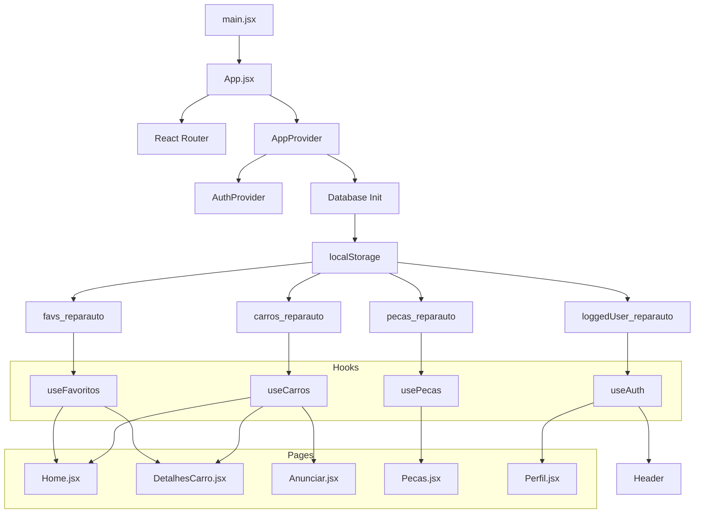
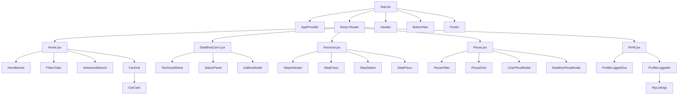

# Plano de Refatoração - ReparAuto

## Diagnóstico da Situação Atual

### O que já foi feito (scaffold inicial com Next.js)
- [x] Projeto Next.js 16.2.6 inicializado com `create-next-app`
- [x] Configuração do Tailwind CSS v3 (`tailwind.config.mjs`)
- [x] Configuração do PostCSS (`postcss.config.mjs`)
- [x] Configuração do Firebase Hosting (`firebase.json` apontando para `out/`)
- [x] Next.js configurado para `output: 'export'`
- [x] Path alias `@/` configurado (`jsconfig.json`)
- [x] Dependências instaladas: `next`, `react`, `react-dom`, `firebase`, `next-intl`, `lucide-react`, `tailwindcss`, `postcss`, `autoprefixer`
- [x] Componente `CarAutocomplete` criado (único componente implementado)
- [x] Estrutura de pastas de componentes criada (vazias)

### O que está quebrado/faltando
- [ ] **Build quebrado** - `layout.js` e `page.js` ainda são template padrão
- [ ] **Pastas de componentes vazias**: `anunciar/`, `auth/`, `detalhes/`, `home/`, `layout/`, `pecas/`, `perfil/`, `providers/`, `ui/`
- [ ] **Pastas vazias**: `src/lib/`, `src/hooks/`, `src/messages/`, `src/styles/`
- [ ] **Sem lógica de dados** - localStorage, seed data, Firebase não implementados
- [ ] **Sem autenticação** - Firebase Auth não configurado
- [ ] **Sem roteamento** - React Router não configurado
- [ ] **`globals.css`** ainda é template padrão
- [ ] **Next.js não é ideal** para static hosting no Firebase (Vite é mais leve e adequado)

---

## 🔄 Decisão: Migrar de Next.js para Vite + React

### Motivos da Migração
1. **Firebase Hosting** é para SPAs estáticas - Vite gera bundles mais leves que Next.js static export
2. **Next.js 16** é excessivo para um marketplace SPA com dados em localStorage
3. **Vite** oferece DX superior (hot reload mais rápido, build mais rápido)
4. **React Router** substitui o App Router do Next.js de forma mais natural para SPA
5. **Removemos dependências desnecessárias**: `next`, `next-intl`, `next/font`

### Stack Final

| Tecnologia | Versão | Função |
|---|---|---|
| Vite | 6.x | Bundler / Dev Server |
| React | 19.2.x | UI Library |
| React Router | 7.x | Roteamento SPA |
| Tailwind CSS | **4.x** | Estilização (utility-first) |
| Firebase | **11.7.x** | Auth + Hosting |
| lucide-react | **0.510.x** | Ícones modernos |

---

## Estrutura de Diretórios Final

```
reparauto/
├── public/
│   ├── 404.html                # Firebase hosting 404 fallback
│   └── robots.txt
├── src/
│   ├── main.jsx                # Entry point (ReactDOM.createRoot)
│   ├── App.jsx                 # Router + Providers
│   ├── index.css               # Tailwind v4 + estilos globais
│   ├── pages/
│   │   ├── Home.jsx            # Listagem de carros
│   │   ├── DetalhesCarro.jsx   # Detalhes do carro (/:id)
│   │   ├── Anunciar.jsx        # Anunciar carro (multi-step)
│   │   ├── Pecas.jsx           # Peças & desmonte
│   │   └── Perfil.jsx          # Perfil do utilizador
│   ├── components/
│   │   ├── layout/
│   │   │   ├── Header.jsx      # Header com navegação, busca, favoritos
│   │   │   ├── Footer.jsx      # Footer com políticas
│   │   │   └── BottomNav.jsx   # Navegação inferior mobile
│   │   ├── home/
│   │   │   ├── HeroBanner.jsx  # Banner principal
│   │   │   ├── CarGrid.jsx     # Grid de cards
│   │   │   ├── CarCard.jsx     # Card individual
│   │   │   ├── FilterChips.jsx # Chips de filtro rápido
│   │   │   └── AdvancedSearch.jsx # Busca avançada
│   │   ├── detalhes/
│   │   │   ├── TechnicalSheet.jsx  # Ficha técnica
│   │   │   ├── StatusPanel.jsx     # Estado (pronto/manutenção)
│   │   │   └── GalleryModal.jsx    # Galeria de fotos
│   │   ├── anunciar/
│   │   │   ├── StepIndicator.jsx   # Passos 1/2/3
│   │   │   ├── StepFotos.jsx       # Passo 1: Fotos
│   │   │   ├── StepDados.jsx       # Passo 2: Dados técnicos
│   │   │   └── StepPreco.jsx       # Passo 3: Preço + Estado
│   │   ├── pecas/
│   │   │   ├── PecasGrid.jsx       # Grid de peças
│   │   │   ├── PecasCard.jsx       # Card de peça
│   │   │   ├── PecasFilter.jsx     # Filtros
│   │   │   ├── CriarPecaModal.jsx  # Modal criar anúncio
│   │   │   └── DetalhesPecaModal.jsx # Modal detalhes
│   │   ├── perfil/
│   │   │   ├── ProfileLoggedOut.jsx
│   │   │   ├── ProfileLoggedIn.jsx
│   │   │   └── MyListings.jsx
│   │   ├── auth/
│   │   │   ├── LoginModal.jsx
│   │   │   └── AuthProvider.jsx
│   │   └── ui/
│   │       ├── Toast.jsx
│   │       ├── Modal.jsx
│   │       ├── Button.jsx
│   │       └── Badge.jsx
│   ├── lib/
│   │   ├── db.js               # localStorage + seed data
│   │   ├── auth.js             # Firebase Auth
│   │   ├── utils.js            # Utilitários
│   │   └── constants.js        # Constantes
│   ├── hooks/
│   │   ├── useCarros.js
│   │   ├── usePecas.js
│   │   ├── useAuth.js
│   │   └── useFavoritos.js
│   └── providers/
│       └── AppProvider.jsx
├── firebase.json               # Hosting → dist/
├── .firebaserc
├── vite.config.js
├── jsconfig.json               # Path alias @/
├── index.html                  # Vite entry (raiz)
└── package.json
```

---

## Plano de Implementação (Ordem de Execução)

### Fase 0: Setup do Vite + React + Tailwind v4
| # | Tarefa | Descrição |
|---|---|---|
| 0.1 | Remover dependências Next.js | `npm uninstall next next-intl` |
| 0.2 | Instalar Vite + React Router + Tailwind v4 | `npm i -D vite @vitejs/plugin-react` + `npm i react-router-dom` + `npm i -D @tailwindcss/vite tailwindcss` |
| 0.3 | Criar `vite.config.js` | Plugin React + Tailwind v4 (`@tailwindcss/vite`), path alias `@/` |
| 0.4 | Criar `index.html` (raiz) | Entry point Vite com `<div id="root">` e link para `src/main.jsx` |
| 0.5 | Criar `src/main.jsx` | `ReactDOM.createRoot`, renderizar `<App />` |
| 0.6 | Atualizar `firebase.json` | `public: "dist"` (output do Vite) |
| 0.7 | Atualizar `package.json` | Scripts: `dev`, `build`, `preview` |
| 0.8 | Remover `tailwind.config.mjs` e `postcss.config.mjs` | Tailwind v4 usa Vite plugin, não precisa mais de PostCSS config |
| 0.9 | Mover/limpar `public/` legado | Remover `public/index.html` do Next.js se existir |

### Fase 1: Fundação (Core Infrastructure)
| # | Tarefa | Descrição |
|---|---|---|
| 1.1 | `src/index.css` | Tema ReparAuto com `@import "tailwindcss"`, custom theme via `@theme`, estilos globais |
| 1.2 | `src/lib/constants.js` | Cores, limites (max 6 fotos, 2MB), textos de políticas, listas (concelhos, combustíveis, etc.) |
| 1.3 | `src/lib/db.js` | Seed data (7 carros + 3 peças do HTML original), CRUD localStorage, migração versão '2.2' |
| 1.4 | `src/lib/utils.js` | `formatarPreco`, `renderDescricao` (markdown simples), `gerarId`, validações |
| 1.5 | `src/lib/auth.js` | Firebase App init, login, logout, onAuthStateChanged |

### Fase 2: Hooks
| # | Tarefa | Descrição |
|---|---|---|
| 2.1 | `src/hooks/useAuth.js` | Hook de autenticação (user, login, logout, loading) |
| 2.2 | `src/hooks/useCarros.js` | Hook de carros com filtros (preço, local, busca, ordenação) |
| 2.3 | `src/hooks/usePecas.js` | Hook de peças com filtros (tipo, categoria) |
| 2.4 | `src/hooks/useFavoritos.js` | Hook de favoritos (toggle, count, list) |

### Fase 3: Providers
| # | Tarefa | Descrição |
|---|---|---|
| 3.1 | `src/providers/AppProvider.jsx` | Provider global (auth context + init database) |

### Fase 4: Componentes UI Base
| # | Tarefa | Descrição |
|---|---|---|
| 4.1 | `src/components/ui/Toast.jsx` | Notificações toast (success, warning, error) com animação |
| 4.2 | `src/components/ui/Modal.jsx` | Modal genérico com focus trap, overlay, fechar ESC |
| 4.3 | `src/components/ui/Button.jsx` | Botão reutilizável (primary, secondary, danger, ghost) |
| 4.4 | `src/components/ui/Badge.jsx` | Badge de estado (Pronto, Reparos, Negociável, Low-Cost) |

### Fase 5: Layout
| # | Tarefa | Descrição |
|---|---|---|
| 5.1 | `src/components/layout/Header.jsx` | Logo, navegação desktop, busca global, favoritos, perfil, filtros avançados, chips |
| 5.2 | `src/components/layout/Footer.jsx` | Logo, copyright, links para políticas com modal |
| 5.3 | `src/components/layout/BottomNav.jsx` | Nav inferior mobile (Pesquisar, Anunciar, Peças, Perfil) |

### Fase 6: Componentes de Páginas
| # | Tarefa | Descrição |
|---|---|---|
| 6.1 | Componentes Home | HeroBanner, CarGrid, CarCard, FilterChips, AdvancedSearch |
| 6.2 | Componentes Detalhes | TechnicalSheet, StatusPanel, GalleryModal |
| 6.3 | Componentes Anunciar | StepIndicator, StepFotos, StepDados, StepPreco |
| 6.4 | Componentes Peças | PecasGrid, PecasCard, PecasFilter, CriarPecaModal, DetalhesPecaModal |
| 6.5 | Componentes Perfil | ProfileLoggedOut, ProfileLoggedIn, MyListings |
| 6.6 | Componentes Auth | LoginModal, AuthProvider |

### Fase 7: Páginas (React Router)
| # | Tarefa | Descrição |
|---|---|---|
| 7.1 | `src/App.jsx` | Configurar React Router com todas as rotas + Header/Footer/BottomNav |
| 7.2 | `src/pages/Home.jsx` | Página inicial com Hero, filtros, grid de carros |
| 7.3 | `src/pages/DetalhesCarro.jsx` | Detalhes do carro (rota `/carro/:id`) |
| 7.4 | `src/pages/Anunciar.jsx` | Anunciar carro (multi-step form) |
| 7.5 | `src/pages/Pecas.jsx` | Peças & desmonte com grid e modais |
| 7.6 | `src/pages/Perfil.jsx` | Perfil do utilizador |

### Fase 8: Build e Deploy
| # | Tarefa | Descrição |
|---|---|---|
| 8.1 | Testar build | `npm run build` → `dist/` sem erros |
| 8.2 | Firebase Deploy | `firebase deploy --only hosting` |

---

## Mapa de Funcionalidades HTML Original → Componentes React

| Funcionalidade HTML | Componente React | Prioridade |
|---|---|---|
| Header + Nav + Busca | `Header.jsx` | Alta |
| Footer + Políticas | `Footer.jsx` | Alta |
| Bottom Nav Mobile | `BottomNav.jsx` | Alta |
| Hero Home | `HeroBanner.jsx` | Alta |
| Grid de Carros | `CarGrid.jsx` + `CarCard.jsx` | Alta |
| Chips de Filtro | `FilterChips.jsx` | Alta |
| Filtros Avançados | `AdvancedSearch.jsx` | Alta |
| Detalhes do Carro | `DetalhesCarro.jsx` + `TechnicalSheet.jsx` + `StatusPanel.jsx` | Alta |
| Galeria de Fotos | `GalleryModal.jsx` | Alta |
| Anunciar (3 passos) | `StepFotos.jsx` + `StepDados.jsx` + `StepPreco.jsx` | Alta |
| Peças Grid | `PecasGrid.jsx` + `PecasCard.jsx` | Média |
| Criar Anúncio Peça | `CriarPecaModal.jsx` | Média |
| Detalhes Peça | `DetalhesPecaModal.jsx` | Média |
| Login | `LoginModal.jsx` + `AuthProvider.jsx` | Média |
| Perfil | `ProfileLoggedIn.jsx` + `ProfileLoggedOut.jsx` | Média |
| Favoritos | `useFavoritos.js` | Média |
| Toast Notifications | `Toast.jsx` | Média |
| Firebase Auth | `auth.js` + `useAuth.js` | Baixa |

---

## Diagrama de Fluxo de Dados



## Diagrama de Componentes



---

## Observações Técnicas Importantes

### Tailwind v4
- **Não usa** `tailwind.config.js` nem `postcss.config.mjs` - a configuração é feita via CSS com `@import "tailwindcss"` e `@theme`
- O Vite plugin `@tailwindcss/vite` substitui o PostCSS plugin
- Cores customizadas são definidas com `@theme { --color-brand-900: #2B3A4E; ... }`
- A sintaxe de classes é a mesma do v3 para a maioria dos casos

### Vite + Firebase Hosting
- `firebase.json` deve apontar `public: "dist"` (pasta de output do Vite)
- `vite.config.js` deve ter `base: './'` para assets relativos
- Usar `HashRouter` do React Router para compatibilidade máxima com Firebase Hosting (evita problemas com rotas e 404)

### Firebase Auth
- Funciona via SDK do lado do cliente (sem problemas com static hosting)
- Configuração hardcoded (como no original) ou via variáveis de ambiente `.env`

### CarAutocomplete.js existente
- Este componente pode ser reaproveitado, apenas ajustando os imports de CSS modules para Tailwind v4

### Ordem de Implementação Recomendada
Fase 0 → Fase 1 → Fase 4 → Fase 5 → Fase 2 → Fase 3 → Fase 6 → Fase 7 → Fase 8

Isso porque hooks dependem de libs, e páginas dependem de componentes de layout e UI.
